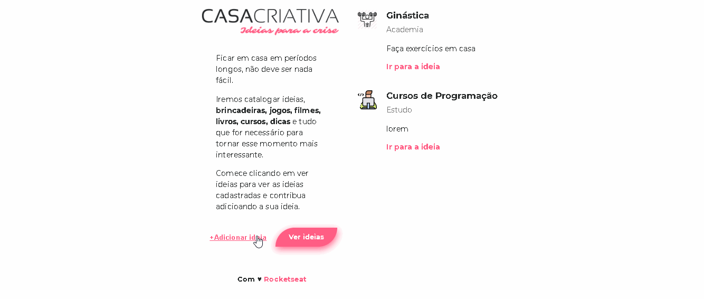

<h1 align="center">
    
</h1>

<h1 align="center">
    
</h1>

# Sobre
Casa Criativa é um marketplace que cataloga idéias para passar o tempo na quarentena.
O projeto é uma aplicação Full Stack desenvolvida no Workshop da Rocketseat. 

# Tecnologias Utilizadas

<b>Back-end:</b>

SQLite3
Node.js
Express

<b>Front-end:</b>

HTML5
CSS3
JavaScript
Nunjucks

___

Desenvolvido por Allana Medrado.